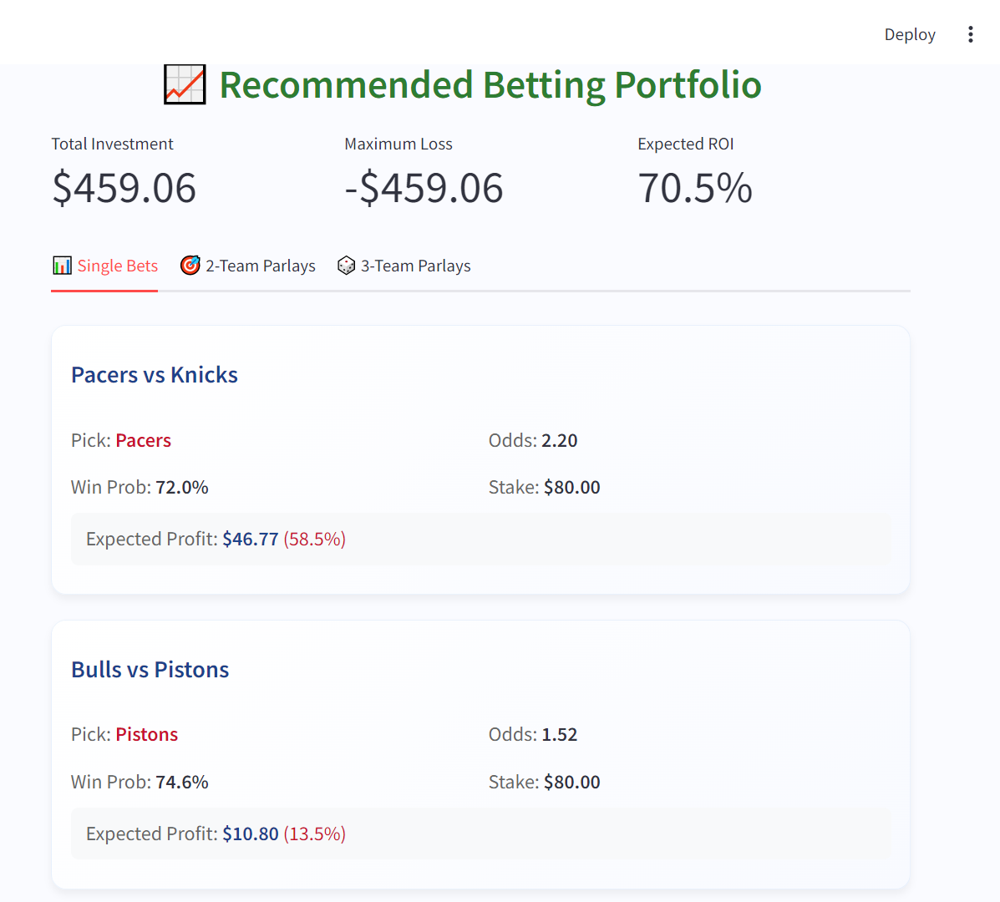

# NBA Betting Portfolio Dashboard

## Overview

An AI-powered dashboard that provides betting portfolio recommendations for NBA games. The system uses machine learning models to analyze game data and predict win probabilities, generating optimized betting strategies.

## Features

- Real-time betting portfolio recommendations
- Win probability predictions for each game
- Expected ROI analysis
- Multiple betting options:
  - Single Bets
  - 2-Team Parlays
  - 3-Team Parlays

## Tech Stack

- Python
- Streamlit
- XGBoost/LightGBM
- Pandas
- NBA API
